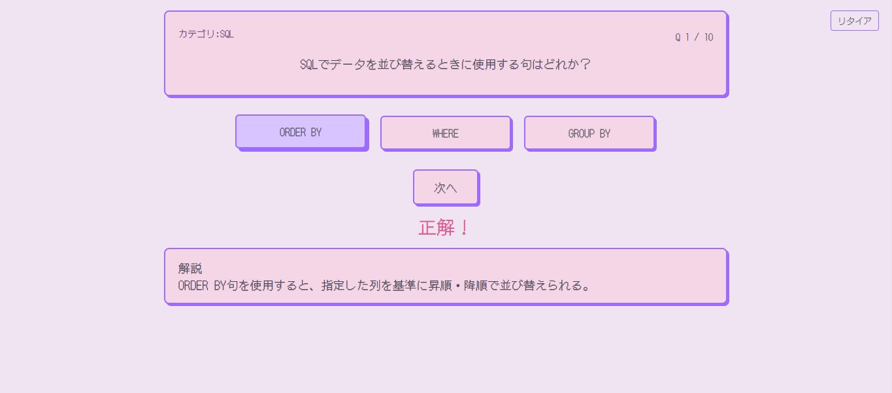
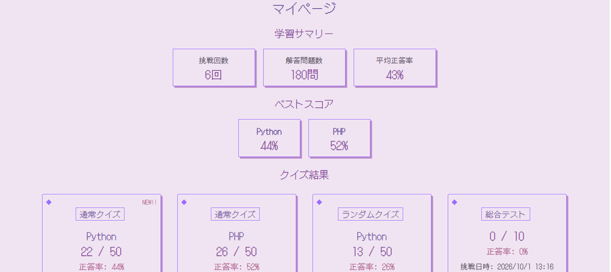

# ProQuiz

## 概要

ProQuizは、プログラミングやITに関する知識をクイズ形式で学習できるWebアプリです。

Python・PHP・SQL・Git・Dockerの5カテゴリに対応しており、
通常クイズ、ランダムクイズ、総合テストから学習方法を選択できます。

ユーザー登録・ログイン機能やクイズ結果の保存、マイページでの学習履歴確認にも対応しています。

## 主な機能

* ユーザー登録・ログイン・ログアウト
* Python・PHP・SQL・Git・Dockerの5カテゴリ
* 通常クイズ
* ランダムクイズ
* 総合テスト（ランダム10問）
* 3択形式のクイズ
* 回答後の解説表示
* クイズ結果の保存
* 回答履歴の保存
* マイページでのクイズ結果・学習履歴の確認
* カテゴリ別のベストスコア表示

## 使用技術

| 分類      | 技術                                |
| ------- | --------------------------------- |
| フロントエンド | React / Vite                      |
| バックエンド  | Laravel / PHP                     |
| データベース  | MySQL                             |
| 認証      | Laravel Fortify / Laravel Sanctum |
| CI      | GitHub Actions                    |
| 開発環境    | XAMPP                             |
| バージョン管理 | Git / GitHub                      |

## 画面

### クイズ開始画面


### クイズ画面



### マイページ



## 工夫した点

* ユーザーごとにクイズ結果・回答履歴を保存可能に
* 学習履歴を確認できるようにマイページを実装
* カテゴリ別ベストスコアを表示
* ReactとLaravelを分けてAPIで通信
* Laravel Fortify / Sanctumを使用した認証
* クイズ問題・選択肢をSeederで管理
* 楽しく勉強できるようにレトロポップをイメージしたデザインに

## テスト

* 実際に各カテゴリ・各クイズモードを操作し、クイズの出題・回答・結果保存・マイページへの反映などの動作を確認しました。

## セットアップ

### 必要な環境

* PHP 8.5.7
* Composer 2.10.1
* Laravel 13.17.0
* Node.js 24.18.0
* npm 11.16.0
* MySQL

### 1. リポジトリを取得

```bash
git clone <GitHubリポジトリのURL>
cd ProQuiz
```

### 2. Backendのセットアップ

```bash
cd backend
composer install
copy .env.example .env
php artisan key:generate
```

`.env` のデータベース設定を確認します。

```env
DB_CONNECTION=mysql
DB_HOST=127.0.0.1
DB_PORT=3306
DB_DATABASE=proquiz
DB_USERNAME=root
DB_PASSWORD=
```

MySQLで `proquiz` データベースを作成した後、マイグレーションとSeederを実行します。

```bash
php artisan migrate --seed
```

### 3. Frontendのセットアップ

別のターミナルで、

```bash
cd frontend
npm install
```

### 4. アプリケーションを起動

Backend：

```bash
cd backend
php artisan serve
```

Frontend：

```bash
cd frontend
npm run dev
```

ブラウザで表示されたFrontendのURLにアクセスします。
